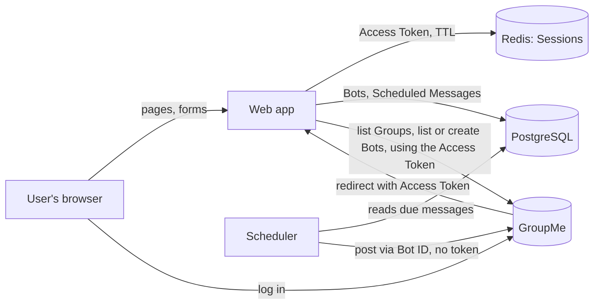
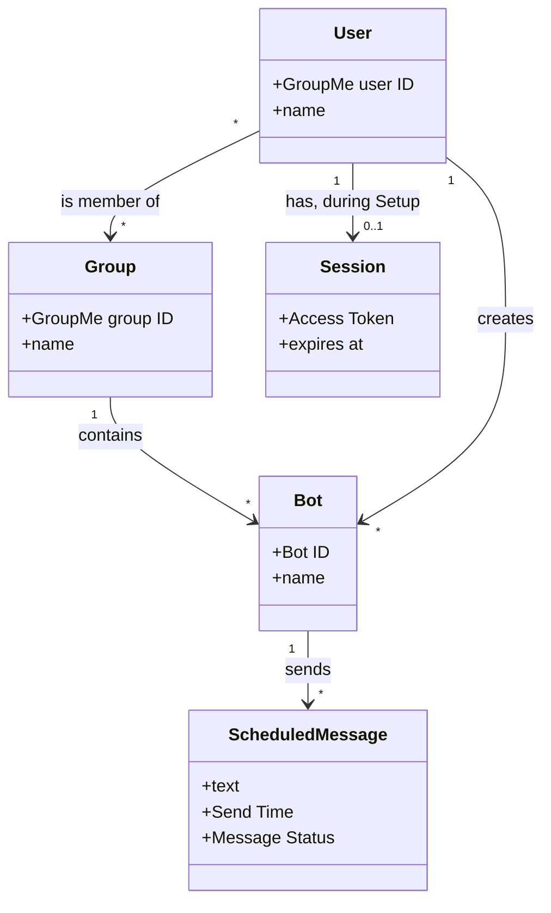

# Software Requirements Specification

**Project:** GroupMe Scheduled-Send Web App
**Version:** 0.1

---

## Identifiers

Every requirement in this document has a slug based on its name. Only the ID spaces this project needs are used.

| Space | For | Example |
|---|---|---|
| `FR-<AREA>-<slug>` | Functional requirements that are not part of any use case | `FR-AUTH-require-session` |
| `UI-<slug>` | User interface requirements | `UI-server-rendered` |
| `SI-<slug>` | Software and system interfaces | `SI-groupme-bots` |
| `CI-<slug>` | Communications interfaces | `CI-https-outbound` |
| `DI-<slug>` | Data requirements | `DI-send-time-utc` |
| `OE-<slug>` | Operating environment | `OE-container-runtime` |
| `CO-<slug>` | Design and implementation constraints | `CO-bots-api-only` |
| `AS-<slug>` / `DE-<slug>` | Assumptions and dependencies | `AS-bot-authorship-acceptable`, `DE-groupme-bots-api` |

Each quality attribute has its own ID space: `USE-` usability, `PER-` performance, `SEC-` security, `SAF-` safety, `AVL-` availability, `ROB-` robustness, `SCA-` scalability, `INT-` interoperability, `MNT-` maintainability.

Use cases keep their own identifiers (`UC-*`), defined in [use-cases.md](use-cases.md).

## Revision History

| Date | Version | Description | Author |
|---|---|---|---|
| 2026-09-23 | 0.1 | Initial draft from the README | Kanta Endo |

---

## 1. Introduction

### 1.1 The purpose of the GroupMe Scheduled-Send Web App

GroupMe cannot schedule a message to be sent later. Its API has no delayed-send endpoint and no `scheduled_at` field. This web app fills that gap. A GroupMe User logs in, picks a Group, picks or creates a Bot in that Group, writes a message, and chooses when it should go out. When that time comes, a background Scheduler posts the message through the Bot.

The whole design is built around one constraint: do the job with as little standing access to the User's GroupMe account as possible. The User's Access Token is needed only during Setup. It lives in a short-lived Session and is wiped as soon as Setup finishes. The message is sent later through the Bots API, which needs only a Bot ID.

### 1.2 The purpose of this document

This document gives the functional and nonfunctional requirements for the first release (the MVP) of the GroupMe Scheduled-Send Web App. It is the reference for the project's scope, behavior, and constraints, for anyone building or testing the system.

### 1.3 Document conventions

- Terms written with capitals (Access Token, Bot, Scheduled Message, Session, …) are defined in the [project glossary](project-glossary.md).
- Requirements use the [EARS](https://alistairmavin.com/ears/) patterns and the identifier formats listed above.
- A placeholder like _[N]_ marks a number that has not been decided yet. Do not replace it with a guess. It gets filled in once the question is answered.

### 1.4 References

- [Project glossary](project-glossary.md)
- [README](../README.md)
- [Use cases](use-cases.md)
- [Open issues](OPEN-ISSUES.md)
- [The Easy Approach to Requirements Syntax (EARS)](https://alistairmavin.com/ears/)
- [GroupMe API documentation](https://dev.groupme.com/docs/v3)
- [GroupMe Bots tutorial](https://dev.groupme.com/tutorials/bots)

---

## 2. Overall Description

### 2.1 Product perspective

The system is a self-contained web application that depends on GroupMe. It has four runtime parts:

- a FastAPI web application that serves the pages and handles the OAuth callback
- a Scheduler (APScheduler) that posts Scheduled Messages when they are due
- PostgreSQL, which holds Bots, Scheduled Messages, and the scheduler's job store
- Redis, which holds Sessions

It connects to GroupMe in two ways: through OAuth (Implicit Grant) to get an Access Token during Setup, and through the GroupMe API to list Groups, list and create Bots, and post messages through Bots.

### 2.2 User classes and characteristics

| User class | Description | Privileges |
|---|---|---|
| User | A person with a GroupMe account who wants to schedule a message to a Group they belong to. Uses the app now and then, needs no technical skill, and is outside any organization. | Only what their own Access Token allows, and only during a Session: see their own Groups, list their own Bots, create Bots in their Groups, schedule messages through a Bot they selected. |
| Scheduler (non-human) | The system's own background process. It is triggered by the clock. | Posts through stored Bot IDs. Never holds an Access Token. |

There is no administrator role in this release. The developer maintains the deployment, which has no in-app functions.

### 2.3 Operating environment

- `OE-container-runtime`: The system shall run as a set of Docker containers defined in one Docker Compose configuration.
- `OE-hosting-platform`: The system shall run on a hosting platform that keeps the Scheduler process running continuously (see `AVL-scheduler-always-on`). Which platform is not decided yet. Railway, Fly.io, Oracle Cloud Free Tier, and a low-cost VPS (Hetzner/DigitalOcean) are the candidates.
- `OE-supported-browsers`: The system shall work correctly on _[browsers and versions to be decided]_.

### 2.4 Design and implementation constraints

- `CO-backend-stack`: The backend shall be written in Python 3.12 using FastAPI, served by Uvicorn.
- `CO-database`: The system shall use PostgreSQL for persistent data, accessed through async SQLAlchemy (`asyncpg`), with schema changes managed by Alembic.
- `CO-session-store`: The system shall store Sessions in Redis.
- `CO-scheduler`: The system shall schedule sends with APScheduler, using a `SQLAlchemyJobStore` backed by the PostgreSQL database.
- `CO-single-scheduler-instance`: Exactly one Scheduler instance shall be running against the job store at any time. APScheduler does not coordinate between processes, so a second instance (another Uvicorn worker, for example) could send the same Scheduled Message twice.
- `CO-http-client`: The system shall call the GroupMe API with `httpx`'s async client.
- `CO-server-rendered-ui`: The user interface shall be server-rendered with Jinja2 templates. Whether to add HTMX has not been decided.
- `CO-bots-api-only`: The system shall post messages only through the Bots API, and shall never post through the Messages API.

### 2.5 Assumptions and dependencies

- `AS-user-has-groupme-account`: Every User already has a GroupMe account and belongs to at least one Group.
- `AS-bot-authorship-acceptable`: Users accept that a Scheduled Message shows up in the Group under the Bot's name, not their own.
- `AS-single-locale`: Users read English (see section 10).
- `DE-groupme-oauth`: Logging in depends on GroupMe's OAuth Implicit Grant flow and on this app being registered at dev.groupme.com with a callback URL.
- `DE-groupme-bots-api`: Creating and listing Bots, and sending, depend on the GroupMe Bots API being available.
- `DE-groupme-groups-api`: Choosing a Group depends on the GroupMe Groups API.

---

## 3. Project Glossary

See [project-glossary.md](project-glossary.md).

## 4. Scope

The problem and the vision are in the [README](../README.md).

**In scope for the MVP:**

- Logging in with GroupMe OAuth, holding the Access Token in a Session that has a TTL
- Choosing a Group the User belongs to
- Selecting one of the User's existing Bots in that Group, or creating a new Bot
- Scheduling one text message for a future Send Time
- Token Wipe once Setup finishes successfully
- Sending each Scheduled Message at its Send Time through its Bot, and recording the result
- Scheduled Messages surviving an application restart

**Out of scope for the MVP:**

- Posting as the User (Messages API)
- Direct messages
- Recurring messages
- Images or other attachments
- Notifying the User when a send succeeds or fails
- Administrator features

**Not decided yet** (so it can't be listed as in or out):

- Letting a User view, edit, or cancel their Pending Scheduled Messages after Setup. This system keeps no user accounts, so any of these would need the User to log in again, and would need Scheduled Messages to be linked to a GroupMe user ID.
- Scheduling more than one message in a single Setup.

---

## 5. Functional Requirements

### 5.1 Use cases

Most of the system's behavior is specified as use cases in [use-cases.md](use-cases.md).

### 5.2 Non-use-case functional requirements

#### Authentication and Sessions

- `FR-AUTH-oauth-redirect`: When the User chooses to log in, the system shall send the browser to GroupMe's OAuth authorization page with the app's registered client ID.
- `FR-AUTH-verify-token`: When GroupMe redirects to the callback URL with an Access Token, the system shall check that token with GroupMe before creating a Session.
- `FR-AUTH-require-session`: If a request for a Setup page arrives without a valid Session, then the system shall send the browser to the login page.
- `FR-AUTH-revoked-token`: If GroupMe rejects a Session's Access Token as unauthorized, then the system shall end that Session and send the browser to the login page.

#### Group and Bot data

- `FR-GRP-all-groups`: When the system lists the User's Groups, it shall include every Group the User belongs to, fetching every page of results from GroupMe.
- `FR-BOT-filter-by-group`: When the system lists existing Bots, it shall show only Bots that belong to the Group the User chose.
- `FR-BOT-no-callback`: When the system creates a Bot, it shall not register a callback URL, because the system never reads Group messages.

#### Scheduled Messages

- `FR-MSG-future-send-time`: If the Send Time submitted for a Scheduled Message is not in the future when the system receives it, then the system shall reject it.
- `FR-MSG-text-length`: The system shall accept Scheduled Message text only if it has at least 1 character after trimming whitespace and is no longer than GroupMe's maximum message length for Bot posts.
- `FR-MSG-atomic-schedule`: When the system stores a Scheduled Message, it shall also register that message's scheduler job so that either both are saved or neither is.

#### Sending

- `FR-SND-status-guard`: When a scheduler job fires, the system shall post the Scheduled Message only if its Message Status is Pending.
- `FR-SND-record-outcome`: When a send attempt finishes, the system shall set the Message Status to Sent (with the time GroupMe accepted it) or to Failed (with the failure reason).

---

## 6. System Rules

This project has no separate business-rules document. Its rules are written as requirements:

- Sessions and tokens: `SEC-session-ttl`, `SEC-token-wipe`, `SEC-token-not-persisted`, `SEC-token-not-logged`, `SEC-redis-no-persistence`, `SEC-send-without-token`
- Scheduled Messages: `FR-MSG-future-send-time`, `FR-MSG-text-length`, `FR-MSG-atomic-schedule`
- Sending: `FR-SND-status-guard`, `ROB-at-most-once`, `CO-single-scheduler-instance`
- Bots: `CO-bots-api-only`, `SEC-bot-id-confidential`

---

## 7. Data Requirements

### 7.1 Business domain model

Users and Groups are owned by GroupMe. This system reads them during Setup and stores only what it needs to send (see 7.2).

### 7.2 Data dictionary

**Bot** (persisted)

| Field | Type | Rules |
|---|---|---|
| Bot ID | string | Required. Assigned by GroupMe. Confidential (`SEC-bot-id-confidential`). |
| Group ID | string | Required. The GroupMe ID of the Group the Bot belongs to. |
| Group name | string | Required. Copied from GroupMe when selected or created. Used for display only. |
| Bot name | string | Required. Validation when creating a Bot: see `UC-BOT-create-bot`. |
| Created at | timestamp (UTC) | Set by the system. |

**Scheduled Message** (persisted)

| Field | Type | Rules |
|---|---|---|
| ID | system-generated | Unique. |
| Bot | reference to Bot | Required. |
| Text | string | `FR-MSG-text-length`. |
| Send Time | timestamp (UTC) | Required. Must be in the future when submitted (`FR-MSG-future-send-time`). See `DI-send-time-utc`. |
| Message Status | enum: Pending, Sent, Failed | Starts as Pending. See the glossary. |
| Sent at | timestamp (UTC) | Set only when the status is Sent. |
| Failure reason | string | Set only when the status is Failed. |
| Created at | timestamp (UTC) | Set by the system. |
| Creator's GroupMe user ID | string | Only if view or cancel becomes part of the scope (see section 4). |

**Session** (Redis only, never persisted)

| Field | Type | Rules |
|---|---|---|
| Session ID | opaque random string | The only thing stored in the browser cookie (`SEC-session-cookie`). |
| Access Token | string | `SEC-token-not-persisted`, `SEC-session-ttl`. |
| Chosen Group, selected Bot | references | Progress through Setup. |

- `DI-send-time-utc`: The system shall store every Send Time as a UTC instant, converted from the time zone the User entered it in.

### 7.3 Reports

None in this release.

### 7.4 Data acquisition, integrity, retention, and disposal

- **Acquisition:** Group and Bot data come from GroupMe during Setup, using the User's Access Token. Message text and Send Time are entered by the User.
- **Access Tokens:** kept only in Redis, for at most the Session TTL, and deleted earlier by the Token Wipe. See `SEC-session-ttl`, `SEC-token-wipe`, `SEC-token-not-persisted`, `SEC-redis-no-persistence`.
- **Scheduled Messages and Bots:** how long Sent and Failed Scheduled Messages are kept, and whether a Bot record is deleted once it has no Pending messages, has not been decided.

---

## 8. External Interface Requirements

### 8.1 User interfaces

- `UI-server-rendered`: Every view shall be a server-rendered page (`CO-server-rendered-ui`).
- `UI-setup-views`: The system shall provide these views: login, Group list, Bot choice (select existing or create new), message composer, and a confirmation page.
- `UI-local-time-display`: The system shall show Send Times in the User's time zone, and shall label which time zone that is.

### 8.2 Hardware interfaces

None.

### 8.3 Software interfaces

- `SI-groupme-oauth`: The system shall get Access Tokens through GroupMe's OAuth Implicit Grant flow. GroupMe sends the token to the registered callback URL as a query parameter.
- `SI-groupme-groups`: The system shall list the User's Groups through the GroupMe Groups API, using the Access Token.
- `SI-groupme-bots`: The system shall list and create Bots through the GroupMe Bots API using the Access Token, and shall post messages through the Bots API using only the Bot ID.
- `SI-groupme-unavailable`: If a GroupMe call fails or times out during Setup, then the system shall show the User an error that lets them retry, and shall not store partial results.

### 8.4 API document

There is no public API. Once the code exists, FastAPI's generated OpenAPI documentation will be the reference for internal endpoints.

### 8.5 Communications interfaces

- `CI-https-outbound`: The system shall make all calls to GroupMe over HTTPS.
- `CI-no-user-notifications`: The system shall not send the User email or other notifications in this release.

---

## 9. Quality Attributes

### 9.1 Usability

- `USE-setup-steps`: A User who is already logged in to GroupMe shall be able to go from the start page to a stored Scheduled Message in no more than _[N]_ page transitions. The value has not been decided.

### 9.2 Performance

- `PER-send-punctuality`: The system shall post each Scheduled Message within _[N]_ seconds after its Send Time, provided the system is running and GroupMe accepts the post. The value has not been decided.

### 9.3 Security

- `SEC-session-ttl`: A Session and its Access Token shall expire automatically no later than 30 minutes after the Session is created, whether or not the User logs out. The exact TTL, between 15 and 30 minutes, has not been decided.
- `SEC-token-wipe`: When a Scheduled Message has been stored successfully, the system shall delete the Access Token from the Session before sending the confirmation response.
- `SEC-token-not-persisted`: The system shall never write an Access Token to PostgreSQL, files, cookies, or any page sent to the browser.
- `SEC-token-not-logged`: The system shall never write an Access Token to any log. This includes the OAuth callback URL, whose query string carries the token, so HTTP access logs must redact or leave out that query string.
- `SEC-redis-no-persistence`: The Redis instance that holds Sessions shall run with disk persistence (RDB and AOF) turned off, so that Access Tokens are never written to disk.
- `SEC-session-cookie`: The session cookie shall contain only the opaque Session ID, and shall be set with `HttpOnly`, `Secure`, and `SameSite=Lax`.
- `SEC-send-without-token`: The Scheduler shall post Scheduled Messages without reading or needing any Access Token.
- `SEC-bot-id-confidential`: The system shall not write Bot IDs to logs, and shall not show a Bot ID to anyone except the User who selected or created that Bot during their Session.
- `SEC-https-only`: In deployment, the system shall serve every page and the OAuth callback over HTTPS only.

### 9.4 Safety

`SAF-not-applicable`: The system posts text into chats. It cannot cause physical harm, so there are no safety requirements.

### 9.5 Availability

- `AVL-scheduler-always-on`: The Scheduler shall run continuously. Hosting that puts idle instances to sleep does not meet this requirement, because a sleeping Scheduler cannot send anything.
- `AVL-uptime`: _[Uptime target not decided yet.]_

### 9.6 Robustness

- `ROB-restart-survival`: When the application restarts, every Pending Scheduled Message shall still be scheduled, because jobs are stored in PostgreSQL.
- `ROB-at-most-once`: The system shall post each Scheduled Message to GroupMe at most once.
- `ROB-missed-send`: If a Send Time passes while the system is down, then the system shall _[send late, or mark it Failed — not decided, including how late a send is still allowed]_.
- `ROB-send-retry`: If GroupMe returns an error or times out when a message is posted, then the system shall _[retry policy not decided]_. Retrying after a timeout could conflict with `ROB-at-most-once`, because the first post may have gone through.

### 9.7 Scalability, interoperability, maintainability

- `SCA-expected-load`: _[Expected number of Users and Scheduled Messages not known yet.]_
- `INT-groupme-v3`: The system shall work with version 3 of the GroupMe API.
- `MNT-compose-up`: A developer shall be able to start the whole system locally, including PostgreSQL and Redis, with one `docker compose up` command.
- `MNT-migrations`: Every database schema change shall be delivered as an Alembic migration.

---

## 10. Internationalization and Localization

- The user interface is in English only (`AS-single-locale`).
- `DI-send-time-utc` and `UI-local-time-display` cover time zones. How the system finds out the User's time zone (browser detection or asking the User) has not been decided.

---

## 11. Other Requirements

- The app must be registered as an application at dev.groupme.com, with its production callback URL, and must follow GroupMe's API terms of use.
